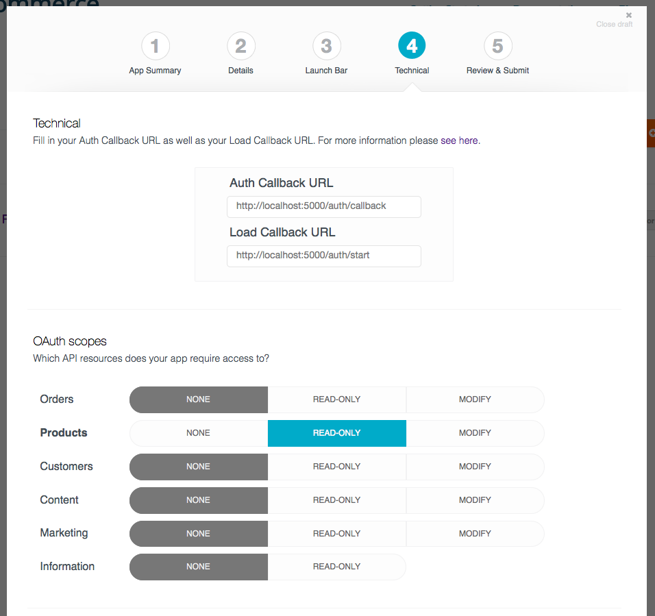

# Bigcommerce Sample App: Hello World in Python and Flask

A sample Flask app which demonstrates using the [Bigcommerce
API](https://pypi.python.org/pypi/bigcommerce-api) as an integrated app within the Bigcommerce control panel.

## Getting Started

### Local set-up

First, clone the repository and set up the Python dependencies:

```bash
git clone git@github.com:bigcommerce-labs/integrated-apps-python-flask-example.git
cd integrated-apps-python-flask-example/

# If you want to use virtualenv
virtualenv ENV/ --python=python2.7
source ENV/bin/activate

# Install dependencies (Flask, bigcommerce-api) through pip
pip install -r requirements.txt

cp config.default.py config.py
```

### Create application tokens

Head to the [Bigcommerce developer portal](https://developers.bigcommerceapp.com/) and sign
in/create a developer account.

Create an draft app on the 'My Apps' page. You'll be able to skip most of the set-up for now **except** for the Technical page.

Recommended values are shown below:



Finally, take your client id and secret from the apps dashboard and place them in `config.py`.

### Installing and running

To start your application server, simply run

```python3
python app.py
```

To test out your application, head to the control panel of a store which you own.

Your app should be available to install from the 'My Drafts' section of the App Store.

## Caveats

* The simple flask server does not use HTTPS, which means some browsers (such as recent versions of
  Firefox) may block your application iframe.
